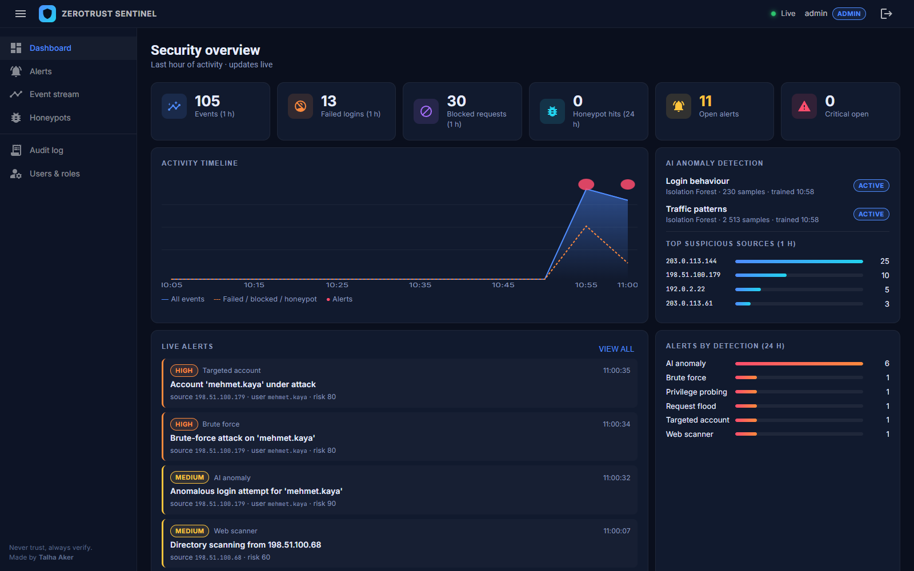
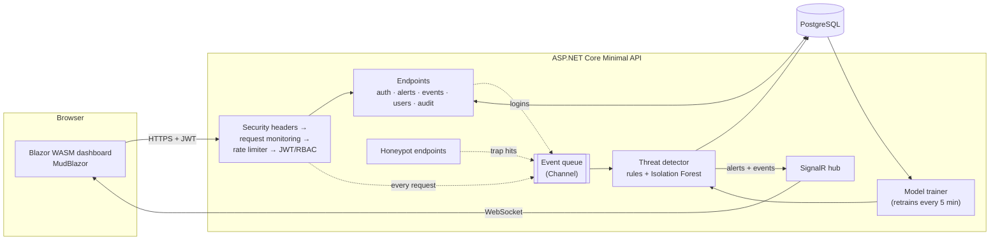

# 🛡️ ZeroTrust Sentinel: AI-Based Security Monitoring Platform


A real-time security monitoring platform that flags suspicious **logins**, **behaviour** and **traffic**
using rule-based detection combined with **AI anomaly detection** (an Isolation Forest implemented from scratch).
Alerts are pushed live over **SignalR** to a **Blazor WebAssembly** dashboard, and the platform itself is built on
**Zero Trust** principles: JWT, RBAC, per-request account verification, rate limiting, audit logging and honeypots.



## Features

| Area | What it does |
|---|---|
| 🤖 **AI anomaly detection** | Two Isolation Forest models, one for *login behaviour* and one for *traffic patterns*. They retrain on recent history every few minutes and explain each alert ("new IP for user = 1, normal ≈ 0.02") |
| 📏 **Rule-based detection** | Brute force, credential stuffing, targeted accounts, privilege probing, request floods and directory scanners |
| 🍯 **Honeypots & honeytokens** | Trap URLs (`/.env`, `/wp-login.php`, `/.git/config`...) serve believable bait. The fake `.env` plants credentials, and any login with them raises a critical alert |
| ⚡ **Real-time dashboard** | Blazor WebAssembly + MudBlazor. Alerts and events stream in over SignalR with no page refresh |
| 🔐 **Zero Trust API** | Every endpoint is deny-by-default. JWT + role-based access. The account is re-verified on **every request**, so deactivating a user kills their sessions instantly |
| 🧾 **Audit logging** | Append-only log of logins and every administrative action: who, what, when and from which IP |
| 🚦 **Rate limiting** | Per-IP limits on login attempts and on the whole API |
| 🐳 **DevSecOps** | Hardened Docker image and compose stack, CI with tests, vulnerable-dependency check, Trivy image scan and an end-to-end smoke test, plus Dependabot |

## Architecture



Requests never wait for detection. They only drop an event into an in-memory queue. A single background worker
analyses events in order, stores them with their alerts, and pushes both to every connected dashboard.

## How detection works

Each event goes through two layers:

**1. Rules: precise and explainable, for well-known attacks**

| Detection | Trigger (defaults) | Severity |
|---|---|---|
| Honeypot | Any request to a trap URL | Critical |
| Honeytoken | Login attempt with a credential that only exists in the fake `.env` | Critical |
| Credential stuffing | ≥ 4 different usernames failing from one IP in 10 min | High |
| Brute force | ≥ 5 failed logins from one IP in 10 min | High |
| Targeted account | ≥ 8 failed logins for one user in 10 min | High |
| Privilege probing | ≥ 3 denied (401/403) requests from one IP in 10 min | Medium |
| Request flood | ≥ 10 rate-limited requests from one IP in 1 min | Medium |
| Web scanner | ≥ 15 requests to non-existent paths from one IP in 1 min | Medium |

**2. AI: catches what rules don't**

For every event a feature vector is computed from sliding windows of recent activity:

| Login behaviour model | Traffic patterns model |
|---|---|
| failed logins from IP (10 min) | requests from IP (1 min) |
| distinct usernames from IP (10 min) | distinct paths from IP (1 min) |
| failed logins for user (10 min) | error ratio from IP (1 min) |
| new IP for this user | 404 responses to IP (1 min) |
| hours away from the user's usual login time (circular mean) | 401/403 responses to IP (10 min) |
| requests from IP (1 min) | |

An **Isolation Forest** ([Liu et al., 2008](https://cs.nju.edu.cn/zhouzh/zhouzh.files/publication/icdm08b.pdf)), implemented from scratch in
[`IsolationForest.cs`](src/Sentinel.Api/Detection/IsolationForest.cs), scores each vector. It builds 100 random
trees that split the data at random points. Anomalies are "few and different", so they are isolated after very few
splits. The score is `s(x) = 2^(−E[h(x)] / c(n))`: near 1 means anomalous, below 0.5 means normal.

Isolation Forest can only split on values it saw during training. A feature that was always 0 in training (such as
"new IP for user") can never isolate a 1. A **z-score novelty guard** in
[`AnomalyModel.cs`](src/Sentinel.Api/Detection/AnomalyModel.cs) therefore lifts the score when any feature is far
outside the learned distribution. The same statistics produce the human-readable explanation in each alert.

Example: an employee who always logs in around 09:00 from their office suddenly logs in at 03:00 from a new IP after
three failed attempts. No single rule fires, but the model raises:

> **Anomalous successful login for 'alice'**: the login behaviour model (Isolation Forest) scored this event 0.87
> (threshold 0.62). Most unusual: new IP for user = 1 (normal ≈ 0.02); hours from user's usual login time = 6 (normal ≈ 0.6);
> failed logins for user (10 min) = 3 (normal ≈ 0.1). A successful login that looks this different from the user's history may indicate account takeover.

The models retrain every 5 minutes on the last 7 days of events, so "normal" keeps up with how people actually work.

## Zero Trust & security controls

| Principle | Implementation |
|---|---|
| **Never trust, always verify** | A fallback authorization policy makes every endpoint require authentication unless it explicitly opts out. On **each request** the JWT's user is re-checked against the database (exists, active, same role, same security stamp) ([`Auth.cs`](src/Sentinel.Api/Security/Auth.cs)) |
| **Least privilege** | Three roles: `Viewer` (read-only), `Analyst` (handle alerts), `Admin` (users + audit log). Enforced by the API, not just hidden in the UI |
| **Instant revocation** | Deactivating a user rotates their security stamp, which invalidates every token already issued |
| **Assume breach** | Honeypots, honeytokens and anomaly detection watch for attackers who already got past the perimeter |
| **Secure authentication** | PBKDF2 password hashing (ASP.NET Identity hasher), constant-time-style login that doesn't reveal which usernames exist, 12+ character passwords, short-lived HS256 JWTs (60 min) |
| **Rate limiting** | 5 login attempts/min and 120 API calls/min per IP |
| **Audit trail** | Append-only audit log: there is no endpoint to edit or delete entries |
| **Secure headers** | Strict Content-Security-Policy, `X-Frame-Options: DENY`, `nosniff`, `no-referrer`, Permissions-Policy |
| **Secrets** | No secret in code or image. Everything comes from environment variables, and startup fails if the JWT key is missing or too short |
| **Hardened container** | Non-root user, read-only filesystem, all Linux capabilities dropped, `no-new-privileges`. The database sits on an internal network with no route to the internet |

## Getting started

### With Docker (recommended)

```bash
git clone https://github.com/t4lh8/ZeroTrust-Sentinel-AI-Based-Security-Platform.git
cd ZeroTrust-Sentinel-AI-Based-Security-Platform
cp .env.example .env        # then put your own random values in .env
docker compose up --build
```

Open **http://localhost:8080** and log in as `admin` with the `ADMIN_PASSWORD` from `.env`.

With `DEMO_MODE=true` (the default) the platform simulates a distributed team plus a new attack scenario every
~25 seconds, so the dashboard comes alive immediately. All simulated IPs come from the RFC 5737 documentation ranges.

### Without Docker (.NET 10 SDK)

```bash
dotnet run --project src/Sentinel.Api
```

The development profile uses SQLite and demo mode, with the users `admin`, `analyst` and `viewer`
(passwords are in [`appsettings.Development.json`](src/Sentinel.Api/appsettings.Development.json)).

### Attack it yourself

```bash
curl http://localhost:8080/.env                       # honeypot → critical alert
curl -X POST http://localhost:8080/api/auth/login \
  -H "Content-Type: application/json" \
  -d '{"username":"backup_admin","password":"Spring2024!backup"}'   # honeytoken → critical alert
for i in $(seq 1 8); do curl -s -X POST http://localhost:8080/api/auth/login \
  -H "Content-Type: application/json" -d '{"username":"admin","password":"guess'$i'"}'; done   # brute force + rate limit
```

Each one shows up on the dashboard within a second.

## API

| Method | Endpoint | Access |
|---|---|---|
| `POST` | `/api/auth/login` | Anonymous (rate limited) |
| `GET` | `/api/auth/me` | Any role |
| `GET` | `/api/overview` | Any role |
| `GET` | `/api/alerts?status=&severity=` | Any role |
| `POST` | `/api/alerts/{id}/acknowledge` · `/resolve` | Analyst, Admin |
| `GET` | `/api/events?type=` | Any role |
| `GET` | `/api/audit` | Admin |
| `GET` `POST` | `/api/users` | Admin |
| `POST` | `/api/users/{id}/deactivate` | Admin |
| `WS` | `/hubs/alerts` (SignalR) | Any role |
| `GET` | `/health` | Anonymous |

## Project structure

```
src/
├── Sentinel.Api/                 ASP.NET Core Minimal API (also hosts the dashboard)
│   ├── Detection/                IsolationForest, AnomalyModel, ActivityTracker, ThreatDetector
│   ├── Monitoring/               event queue + processor + model trainer, middleware, SignalR hub
│   ├── Security/                 JWT, RBAC policies, Zero Trust token validation, audit logger
│   ├── Endpoints/                auth, dashboard API, honeypots
│   ├── Data/                     EF Core entities and DbContext (PostgreSQL / SQLite)
│   └── Demo/                     traffic and attack simulator
├── Sentinel.Web/                 Blazor WebAssembly + MudBlazor dashboard
└── Sentinel.Shared/              DTOs shared by API and dashboard
tests/Sentinel.Tests/             xUnit: algorithm, detection rules and API integration tests
```

## Tests & CI

```bash
dotnet test
```

The tests cover the Isolation Forest maths, every detection rule, and the API end-to-end: authentication, RBAC,
token revocation, rate limiting, honeypots, honeytokens and security headers.

Every push runs [`.github/workflows/ci.yml`](.github/workflows/ci.yml):

1. Build and run all tests
2. Fail if any NuGet dependency has a known vulnerability
3. Build the Docker image and scan it with **Trivy**
4. Start the full stack with `docker compose` and smoke-test the running platform

## Limitations & next steps

- Detection state (sliding windows, cooldowns) lives in memory, so it is one instance. Scaling out would move it to Redis.
- Behind a reverse proxy, forwarded headers must be configured so rate limiting sees real client IPs.
- The schema is created with `EnsureCreated`. A production setup would use EF Core migrations.
- Possible extensions: MFA, GeoIP-based "impossible travel", automatic IP blocking, SIEM export (syslog/CEF).

## What I learned

- Designing an **event-driven detection pipeline** that never slows down requests
- How **Isolation Forest** works, its blind spot for unseen values, and making ML alerts **explainable**
- Why training data must match live data: a mismatch produced false positives during development
- Applying **Zero Trust** in practice: deny-by-default, per-request verification, instant revocation
- Real-time UIs with **SignalR** and **Blazor WebAssembly**
- **DevSecOps**: container hardening, dependency and image scanning, end-to-end checks in CI

## License

[MIT](LICENSE). Made by **Talha Aker**.
